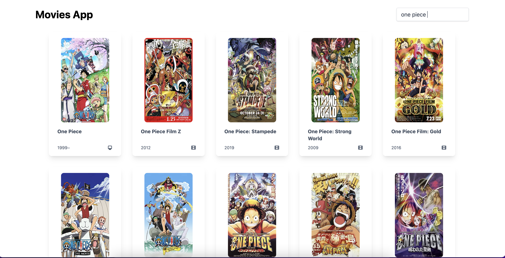

<h1 style="text-align:center">Fueremi Movies App</h1>

  A simple react web application to search movies from <a href="https://www.omdbapi.com/">OMDB API</a>  
  <small>Created by <a style="text-decoration: underline" href="https://github.com/fueremi">@fueremi</a></small>

<h2>Live Demo</h2>

<a href="https://fueremi-movies.netlify.app">Click Here</a> to open live demo.

<h2>Technologies/Tools</h2>
<ol>
  <li><a href="https://reactjs.org/">React.js</a></li>
  <li><a href="https://tailwindcss.com/docs/guides/create-react-app">Tailwind CSS</a></li>
  <li><a href="https://redux.js.org/">Redux</a></li>
  <li><a href="https://react-redux.js.org/">React Redux</a></li>
  <li><a href="https://code.visualstudio.com/">VS Code</a></li>
</ol>

<h2>Still on going ...</h2>
