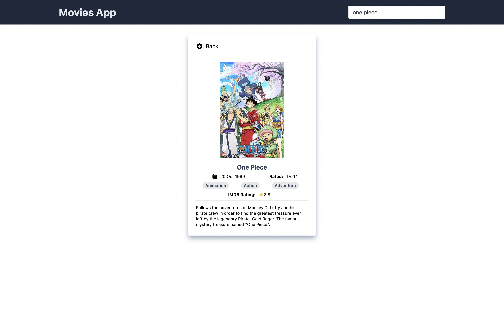
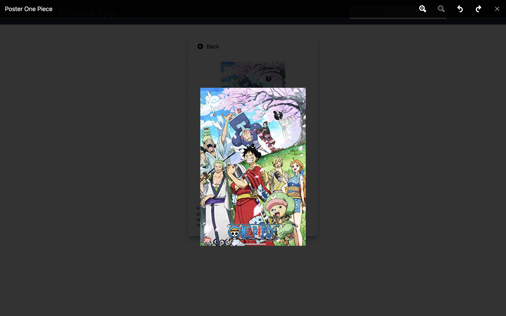

<h1 style="text-align:center">Fueremi Movies App</h1>
<p style="text-align:center">
  A simple react web application to search movies from <a href="https://www.omdbapi.com/">OMDB API</a> <br>
  <small>Created by <a style="text-decoration: underline" href="https://github.com/fueremi">@fueremi</a></small>
</p>

<h2>Preview</h2>
<div style="display: flex; justify-content: center; align-items: center; gap: 8px">



</div>

<h2>Live Demo</h2>
<p><a href="https://fueremi-movies.netlify.app">Click Here</a> to open live demo.</p>

<h2>Technologies/Tools</h2>
<ol>
  <li><a href="https://reactjs.org/">React.js</a></li>
  <li><a href="https://tailwindcss.com/docs/guides/create-react-app">Tailwind CSS</a></li>
  <li><a href="https://redux.js.org/">Redux</a></li>
  <li><a href="https://react-redux.js.org/">React Redux</a></li>
  <li><a href="https://www.npmjs.com/package/axios">Axios</a></li>
  <li><a href="https://code.visualstudio.com/">VS Code</a></li>
  <li><a href="https://www.netlify.com/">Netlify</a></li>
</ol>

<h2>Features</h2>
<ol>
  <li>Display list dari movies</li>
  <li>Infinite Scroll</li>
  <li>Single Page for movie detail</li>
  <li>Show movie poster in a popup window when image clicked</li>
  <li>Autocomplete movie when typing on input</li>
</ol>

<h2>How To Start</h2>
<ol>
  <li>Clone this repo 
  
  ```bash
  git clone https://github.com/fueremi/React-2022-Movie_App.git
  ```

  </li>
  <li>Go to project folder
  
  ```bash
  cd React-2022-Movie_App
  ```

  </li>
  <li>Install depedencies
  
  ```bash
  npm install #or
  yarn install
  ```

  </li>

  <li>Run dev server

```bash
npm start
yarn start
```

You can now view the project in browser [(Click Here)](http://localhost:3000)

  </li>
</ol>

<h2 style="text-align: center">Thank You</h2>
